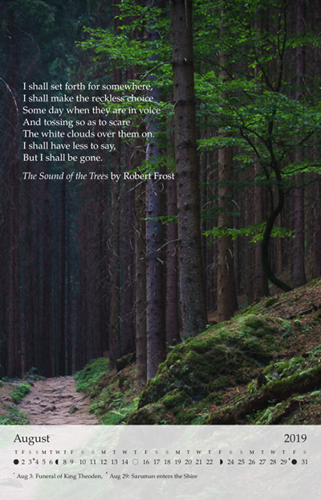

# Wallcalendar in LaTeX, portrait page layouts

An example template for [Overleaf](https://overleaf.com)

Open in Overleaf: https://www.overleaf.com/read/kjpcxcsmxkjc

See also `wallcalendar` package on Github: https://github.com/profound-labs/wallcalendar

